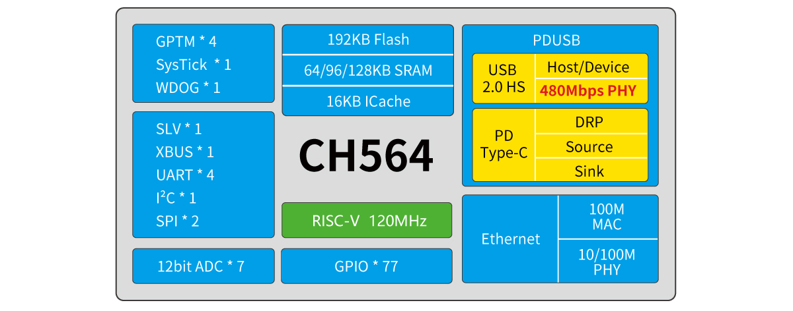

# ch564

EN | [中文](README_zh.md)

> 32-bit RISC-V MCU built-in Ethernet 100M MAC/100M PHY and USB2.0 High-Speed

### Overview

CH564 is an industrial-grade microcontroller based on barley RISC-V core design. CH564 built-in USBHS PHY and PD PHY, support for USB Host host and USB Device device functions, PDUSB and Type-C fast charging; built-in Ethernet controller MAC and 10 megabits/100 megabits physical layer transceiver; provides an external bus interface XBUS, 8-bit passive parallel port SLV, 12-bit analogue-to-digital converter ADC, multi-group timer, 4-group UART serial port, I2C interface, 2 SPI interface and other rich peripheral resources.

### System Block Diagram

### Features

- RISC-V4J processor, up to 120MHz system frequency
- 64/96/128K SRAM, 192K Flash
- Supply voltage: 2.5/3.3V, GPIO unit independent power supply
- Multiple low-power modes: sleep, deep sleep
- Power on/off reset
- 9-channel 12-bit ADC conversion (support DMA)
- 4 sets of timers(TIM0/1/2 support DMA function)
- USB2.0 high-speed host/device interface (480Mbps built-in PHY)
- USB PD and Type-C Controllers and PHY
- 4 UART interfaces
- XBUS interface
- 8-bit passive parallel port
- 1 group IIC interface, 2 groups SPI interface
- Gigabit Ethernet controller ETH (built-in 10M/100M PHY)
- 77 I/O ports, partially 5V tolerant
- 96-bit chip unique ID
- Serial single-wire (default)/two-wire debug interface
- Package: LQFP, QNF
