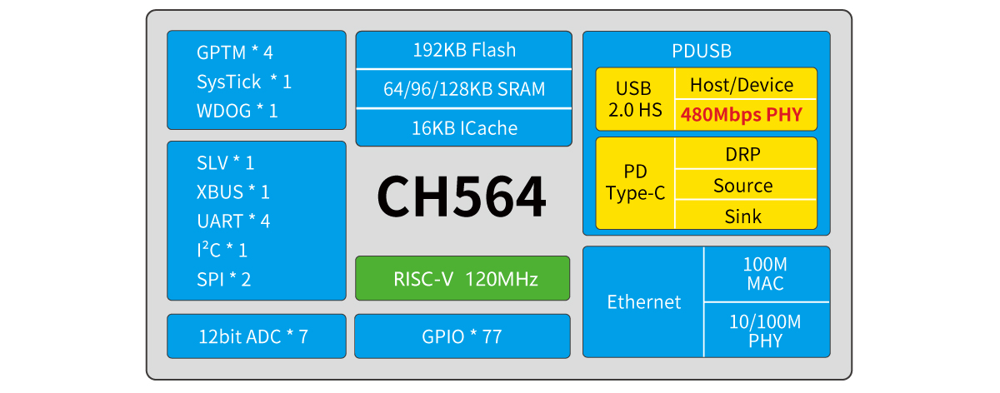

# ch564

[EN](README.md) | 中文

> 32 位 RISC-V MCU 内置以太网 100M MAC/100M PHY 和 USB2.0 高速接口

### 概述

CH564是一款基于青稞RISC-V内核设计的工业级微控制器。CH564内置USBHS PHY和PD PHY，支持USB Host主机和USB Device设备功能、PDUSB及Type-C快充功能；内置以太网控制器MAC和10兆/100兆物理层收发器；提供了外部总线接口XBUS、8位被动并口SLV、12位模数转换ADC、多组定时器、4组UART串口、I2C接口、2个SPI接口等丰富外设资源。

### 系统框图

### 产品特点

- RISC-V4J处理器，最高120MHz系统主频
- 64/96/128K SRAM，192K Flash
- 供电电压：2.5/3.3V，GPIO单元独立供电
- 多种低功耗模式：睡眠、深度睡眠
- 上/下电复位
- 9通道12位ADC转换
- 4组定时器
- USB2.0高速主机/设备接口（480Mbps 内置PHY）
- USB PD和Type-C控制器及PHY
- 4个UART接口
- XBUS接口
- 8位被动并口
- 1组IIC接口、2组SPI接口
- 千兆以太网控制器ETH（内置10M/100M PHY）
- 77个I/O口，部分耐受5V
- 96位芯片唯一ID
- 串行单线（默认）/两线调试接口
- 封装形式：LQFP、QNF
